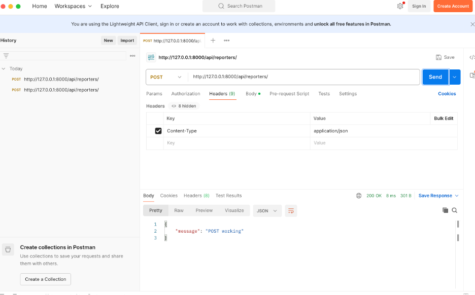
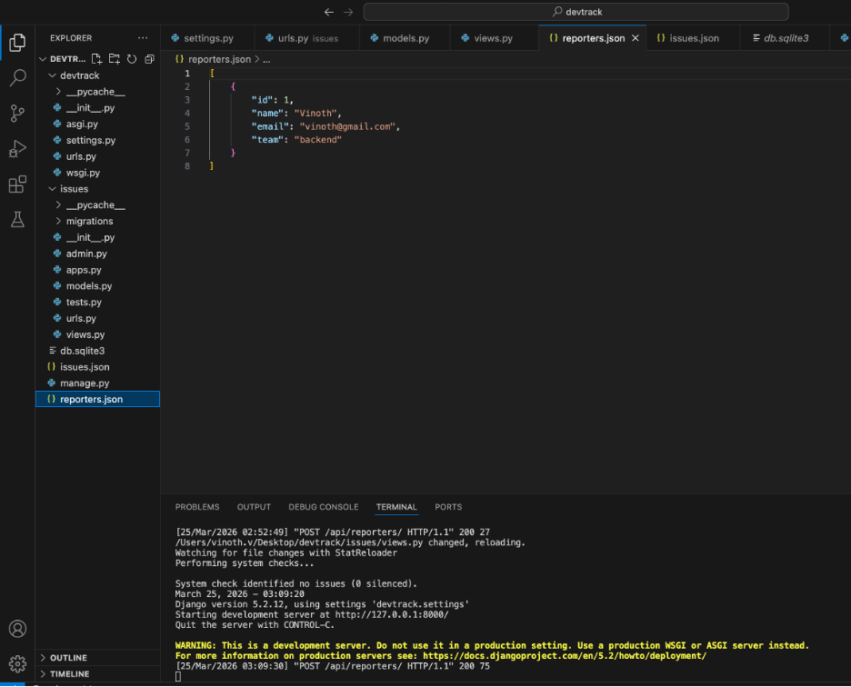
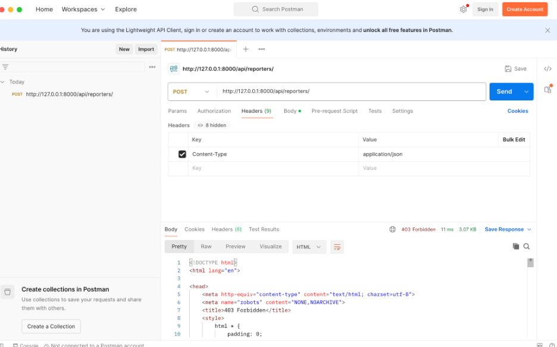
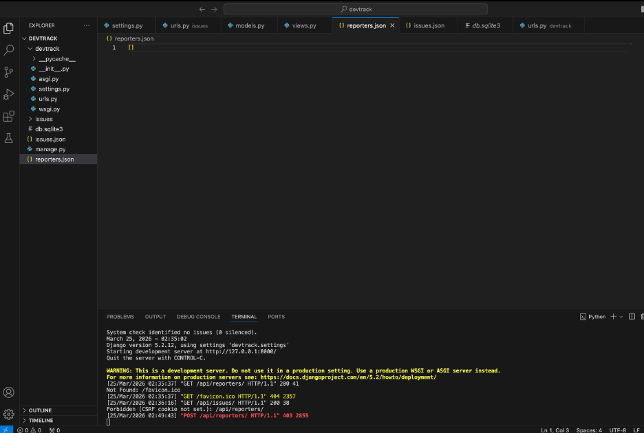

# Issue Tracker API (Django)

This is a simple Django-based API to manage reporters and issues.

The project is built as part of a learning exercise to understand backend development, API handling, and file-based storage.

---

## Features

* Create reporters using POST API
* Fetch reporters using GET API
* Store data using JSON files
* Basic error handling (403, invalid requests)

---

## Tech Stack

* Python
* Django
* JSON (file storage)
* Postman (for testing APIs)

---

## API Endpoints

### 1. Create Reporter

POST /api/reporters/

Request Body:

```json
{
  "id": 1,
  "name": "Vinoth",
  "email": "vinoth@gmail.com",
  "team": "backend"
}
```

Response:

```json
{
  "id": 1,
  "name": "Vinoth",
  "email": "vinoth@gmail.com",
  "team": "backend"
}
```

---

### 2. Get Reporters

GET /api/reporters/

Response:

```json
[
  {
    "id": 1,
    "name": "Vinoth",
    "email": "vinoth@gmail.com",
    "team": "backend"
  }
]
```

---

## Screenshots

### Successful POST Request  


### Another Success Response  


### Failure Case (403 Forbidden)  


### Another Failure Case  


---

## Design Decision

File Handling Strategy:

* Used JSON file (reporters.json) as temporary storage
* Used dynamic file path:

```python
os.path.join(os.getcwd(), "reporters.json")
```

Why:

* Ensures correct file access regardless of where the app runs
* Avoids path-related issues
* Makes the project simple and portable

---

## How to Run

1. Clone the repository
2. Navigate to project folder

```bash
cd issue-tracker-django
```

3. Run server

```bash
python manage.py runserver
```

4. Test APIs using Postman

---

## Notes

* This project is for learning purposes
* Uses file storage instead of database for simplicity
